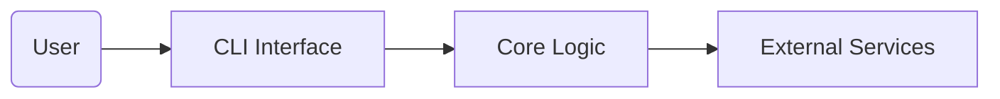

# template-python-cli
Template project for a Python command-line application using best practices

## What it is
A starter template for building Python command-line applications using best practices. This repository provides a ready-to-use skeleton with a CLI entry point, packaging setup, testing harness, documentation scaffolding, and automation via GitHub Actions.

## Why it exists
This project exists to save time when bootstrapping new CLI tools. It encapsulates common patterns—such as argument parsing, test structures, continuous integration, and packaging—so you can focus on implementing your application's logic instead of boilerplate.

## Architecture


The CLI entry point resides in `src/template_python_cli/cli.py` and delegates to reusable modules within the package. Tests live under the `tests/` directory. Additional scripts and examples are provided in `scripts/` and `examples/`. See `docs/architecture.md` for a more detailed diagram and explanation.

## Quickstart
1. Install the package in editable mode for development:

```bash
git clone <repository-url>
cd template-python-cli
python -m venv .venv
source .venv/bin/activate  # or .venv\\Scripts\\Activate.ps1 on Windows
pip install -e .
```

2. Run the CLI:

```bash
python -m template_python_cli.cli --help
```

This displays the available options.

3. Run tests:

```bash
pytest -q
```

## Usage examples
After installation, you can invoke the CLI directly from the command line. For example:

```bash
# Print a greeting
python -m template_python_cli.cli --name "Cardale"

# Use a configuration file
python -m template_python_cli.cli --config examples/config.yaml
```

The `examples/` directory contains sample configuration files to get you started.

## Roadmap
- Add argument validation and richer error handling.
- Package the CLI with `setuptools` entry points for easier installation.
- Expand the example library to demonstrate subcommands and structured output.
- Add type hints and integrate static analysis tools.

## Security notes
This template does not store any secrets or credentials. Ensure that your own CLI implementations follow secure coding practices and avoid logging sensitive information. Keep dependencies updated using Dependabot.
