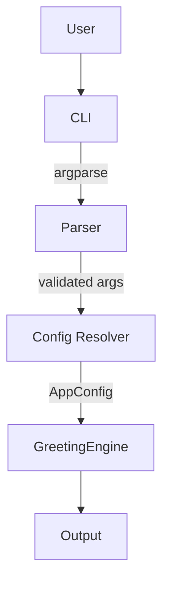

# Architecture

- **CLI (`src/template_python_cli/cli.py`)**: Parses arguments, sets up logging, and orchestrates runtime steps.
- **Config resolver (`src/template_python_cli/config.py`)**: Layers defaults, config files, environment variables, and CLI flags into a validated `AppConfig` dataclass.
- **Greeting engine (`generate_messages`)**: Produces deterministic, testable output in text or JSON form.
- **Packaging (`pyproject.toml`)**: Defines the console script entry point and dependencies.

The code is intentionally modular: configuration logic is isolated from business logic, making it straightforward to extend with new subcommands or additional output formats.
