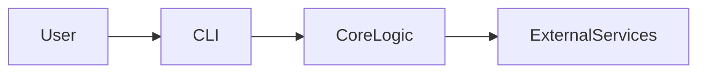

# Architecture

This CLI template uses a modular design where the CLI entrypoint dispatches commands to core logic modules. The core logic interacts with external services or performs tasks accordingly. You can extend the architecture by adding more modules for additional commands.
